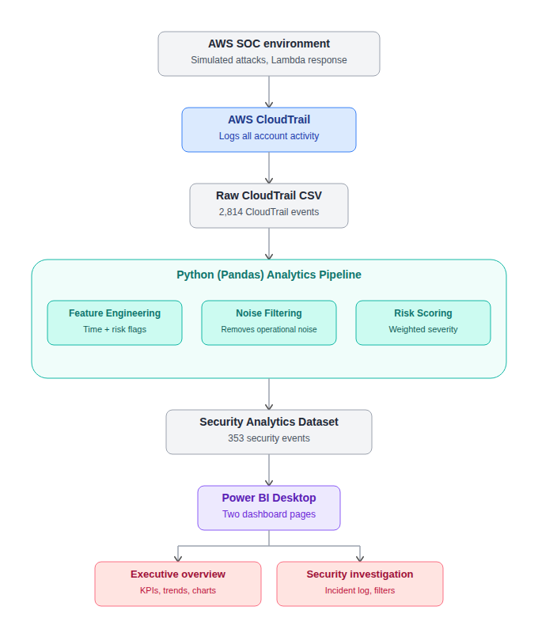
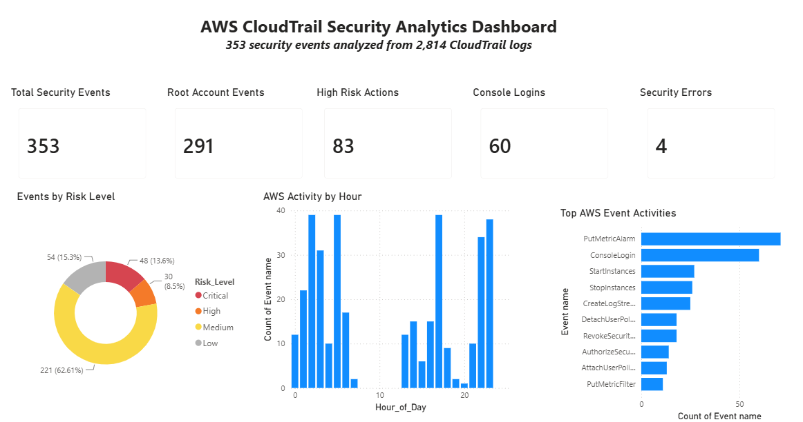
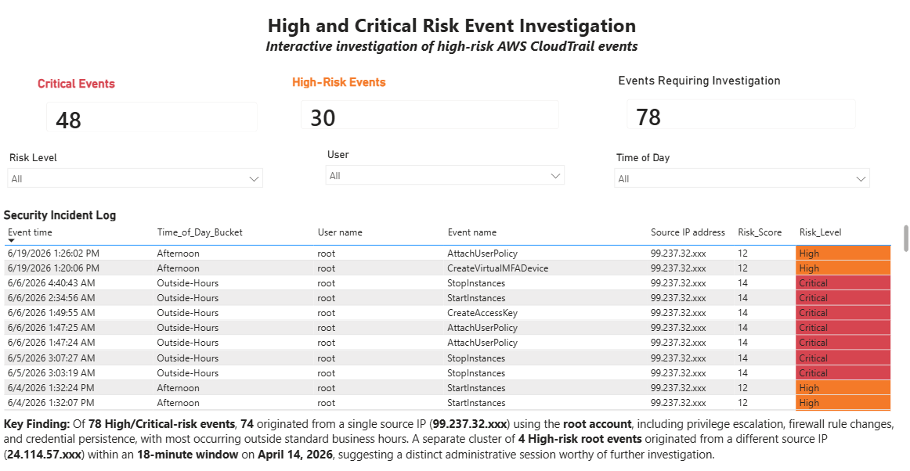

# AWS CloudTrail Security Analytics

Security analytics project that transforms raw AWS CloudTrail logs into actionable security insights using **Python (Pandas)** and **Power BI**.

The project combines cloud security concepts with data analytics by transforming raw CloudTrail logs into an investigation-ready dataset for security analysts.

This project builds directly on my AWS Cloud SOC capstone, where I simulated attacks and automated detection using AWS Lambda. Instead of focusing on infrastructure, this project analyzes the resulting CloudTrail logs at scale to identify high-risk AWS activity, remove operational noise, and support security investigations.

---

## Architecture



---

## Project Overview

AWS CloudTrail records API calls and management events within an AWS account. While valuable for auditing, CloudTrail datasets can contain thousands of operational events that make security investigations difficult.

This project demonstrates how Python-based data analytics can transform raw CloudTrail logs into a security-focused dataset that helps analysts quickly identify suspicious activity.

The workflow includes:

- Data cleaning and preprocessing
- Feature engineering
- Operational-noise filtering
- Security risk scoring
- Interactive Power BI dashboards

---

## Dashboard Preview

### Executive Overview



### Security Investigation



---

## Data Source

The dataset was generated from my AWS Cloud SOC capstone project.

It contains:

- **2,814 CloudTrail events**
- IAM activity
- EC2 instance operations
- Console logins
- Security group modifications
- Multiple months of simulated cloud activity

---

## Project Workflow

### 1. Data Cleaning

Using **Python (Pandas)**, the raw CloudTrail CSV was cleaned and standardized.

Key preprocessing steps included:

- Timestamp conversion
- Missing-value handling
- Column normalization
- Time-based feature extraction

### 2. Feature Engineering

Several security-focused features were created to support risk analysis:

- `Is_Root_Account`
- `Is_High_Risk_Action`
- `Is_Console_Login`
- `Is_Security_Error`
- `Time_of_Day_Bucket`
- `Hour_of_Day`

### 3. Operational Noise Filtering

Exploratory analysis revealed that `UpdateInstanceInformation` events accounted for **2,461 of 2,814 events (87%)**.

These events were identified as AWS Systems Manager (SSM) heartbeat traffic rather than security activity. Instead of deleting them, they were flagged as operational noise, which preserved:

- The original dataset (`df_clean`)
- The security-focused dataset (`df_security`)

Final investigation dataset: **353 security-relevant events**

### 4. Risk Scoring

A weighted scoring model was developed to prioritize events requiring analyst attention.

| Indicator | Score |
|-----------|------:|
| Root account activity | +5 |
| High-risk AWS action | +7 |
| Security error | +4 |
| Outside business hours | +2 |

Events were classified into four severity levels: **Critical, High, Medium, Low**.

### 5. Risk Model Refinement

The initial scoring thresholds produced an imbalanced distribution, with too many events classified as Critical. After reviewing the score distribution, the thresholds were refined to better separate Critical and High events.

Final distribution:

| Risk Level | Events |
|------------|-------:|
| Critical | 48 |
| High | 30 |
| Medium | 221 |
| Low | 54 |

### 6. Power BI Dashboard

The processed dataset was imported into Power BI Desktop to build two interactive dashboard pages.

**Executive Overview**

- Security KPI cards
- Risk-level distribution
- Hourly activity analysis
- Top AWS event types

**Security Investigation**

- Interactive incident log
- Risk-level filtering
- User filtering
- Time-of-day filtering
- Conditional formatting for Critical and High events

---

## Key Findings

- **78 Critical/High-risk events** were identified after risk scoring.
- **74 of those events** originated from a single masked source IP (`99.237.32.xxx`) using the **root** account. The activity included privilege escalation, firewall rule changes, and credential persistence, with most events occurring outside standard business hours.
- A separate cluster of **4 High-risk root events** originated from a different masked IP (`24.114.57.xxx`) within an **18-minute window** on April 14, 2026, suggesting a distinct administrative session or location worthy of further investigation.
- A secondary account (`project-user`) performed a high-risk EC2 action from the same primary IP, indicating that multiple identities may have been used during the same administrative session.
- Root account activity represented **291 of 2,814 raw CloudTrail events**, highlighting excessive privileged account usage compared with AWS security best practices.

---

## Technologies Used

- Python
- Pandas
- Google Colab
- Power BI Desktop
- AWS CloudTrail
- GitHub

---

## Repository Structure

```text
aws-cloudtrail-security-analytics/
│
├── README.md
├── LICENSE
├── requirements.txt
│
├── notebooks/
│   └── CloudTrail_Security_Analytics.ipynb
│
├── data/
│   └── cloudtrail_security_events_public.csv
│
├── dashboards/
│   └── AWS_CloudTrail_Security_Analytics_Public.pbix
│
└── images/
    ├── cloudtrail_pipeline_architecture.png
    ├── Executive_Overview.png
    └── Security_Investigation.png
```

---

## What This Project Demonstrates

This project demonstrates my ability to:

- Analyze AWS CloudTrail security logs
- Build end-to-end data analytics workflows using Python
- Engineer meaningful security features
- Separate operational noise from security-relevant activity
- Design and tune a practical risk-scoring model
- Build interactive Power BI dashboards for incident investigation
- Present technical findings in a clear, investigation-focused format

---

## Data Privacy

The public dataset and dashboard included in this repository have been sanitized before publication.

Sensitive information has been removed or anonymized, including:

- Source IP addresses (masked, e.g. `99.237.32.xxx`)
- AWS access keys (removed)
- Account identifiers (masked)
- Request IDs (removed)
- Event IDs (removed)
- Project-specific usernames (generalized, e.g. `project-user`)

This repository is intended for educational and portfolio purposes only.

---

## Future Improvements

- Integrate Amazon Athena for large-scale CloudTrail analysis
- Add Splunk dashboards for SIEM correlation
- Incorporate GuardDuty findings
- Perform anomaly detection using machine learning

---

## Author

**Farhana Ahmed**

Graduate Student in Cybersecurity

Interested in Cloud Security • Security Analytics • Data Analytics

Toronto, Canada